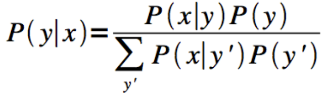

1. Naive Bayes adopts a **generative** approach to classification 

2. Below select all that apply. A generative classifier

- It is probabilistic and but not all probabliistics classifiers are generative
- Construct a model of each class

3. A bayesian classifier that chooses between several classes makes its choice based on

- The probability of each class given the attribute value

4. In the Bayesian formulation of the probability of class y given data x: 

- p(x|y)  
- p(y) = prior believe of y  

7. The essence of Naive Bayes is that it is a Bayesian classifier with a particular assumption. That assumption is: **The attributes are conditionally independent given the class**

8. To create a classifier that uses Bayes rule, we have to assume something about probability distribution of each class in the population. (True)

9. Below select all that apply. The Gaussian Naive Bayes nmodel assumes: For a given class, it is reasonable to model each of the attributes with its own gaussian.

10. For a probabilistic classifier, the decision boundary represents the points where classes are equally probable

11. If attributes have discrete values, Naive Bayes calculates the probability of a particular attributes value given a class P(X|Y) by counting how many instances of the class have each attribute value.

12. Match up the issue on how Naive Bayes handles it.

- Missing attribute values for some data points at training time -> ignore them - don't add anything to any count

- attributes with a zero count in a class -> add a small amount to each count

