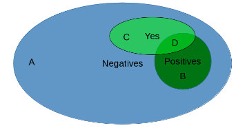
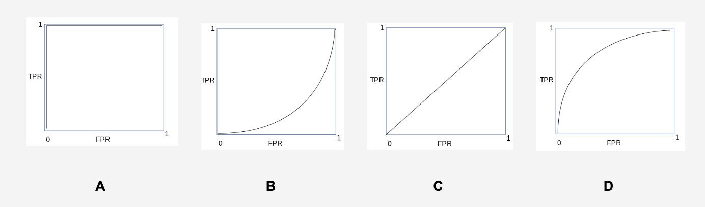

1. In this diagram, the **negative instances are in the blue oval**, the **positive instances in the darker green circle**. Our classifier says the instances in the **light green oval are positive**. and **all the others are negative**.

What do we call each of the region A, B, C, and D?

A. True Negative
B. False Negative
C. False Positive
D. True Positive

2. Match up the measure each other:

- False Alarm Rate  : % of negatives we misclassified as positive
- Miss Rate         : % of positives we misclassified as negative
- Recall            : % positive out of what we classified as positive
- Precision         : % of positives we classified correctly

3. Match up the items on the left agains the items on the right.

- Accuracy              : Correct / Total = (TP + TN) / (TP + TN + FP + FN).
- Classification Error  : 1 - Accuracy
- False Alarm           : False Positive Rate = FP / (FP + TN)
- Miss                  : False Negative Rate = FN / (FP + TP)
- Recall                : True Positive Rate = TP / (TP + FN)
- Precision             : TP / (TP + FN)

* why there is no true negative rate?

5. The F1 measure is (select all that apply).

- 2 / (1/Recall + 1/Precision)
- (2 x recall x precision) / (precision + recall) 
- The harmonic mean of precision and recall

6. If we have the following performance of two classifiers A and B:

 	A	B
TP	30%	20%
FP	30%	15%

then which is better?

Possible Answer
I. It's impossible to decide whether system A or B is better. Usually a model have an objective what they want to achieve. It's related to its utility and cost of the model. The better model should have higher evaluation on a specific goal. For example lower False Negative Rate (The case of beneign and fatal tumor).

II. It may come from same classifier. If you tune up or dow the **confidence function** of a classifier you will get various evaluation matrix depends on your favor. This topics related to the ROC (Receiver Operating Characteristic) graph.

7. Match up the following ROC curves with their interpretation.

A. Perfect Classifier
B. Worse than random coin toss
C. Equal to random coin toss
D. Better than random coin toss

8. The following measure are useful for evaluation in a regression task (select all that apply)

- MSE
- Correlation Coefficient
- Mean Absolute Error

What you need to review? 

- F1 Score
- The guideline how to use error measure.
- ROC / AUC
- Correlation coefficient.