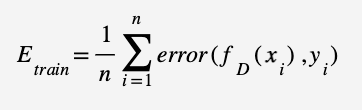

1. Generalisation is about (select that apply)
- [x] how well our classifier performs on unseen data.
- [x] how well our classifier performs on testing data.
- [x] how well our classifier performs on validation data

- [ ] how well our classifier performs on training data

2. Match the items

- A. Overfitting:  
- B. Both overfitting and underfitting:  
- C. Neither overfitting nor underfitting:  
- D. Underfitting:  

4. In the formula for error on the training set:  

- error = The function that computes the error for the instances
- Fd function that predicts the label for an instance
- Xi Training instances
- Yi the labels

5. Estimating the generalisation error from the training error requires us to 
- First estimate the testing error from the training error
- Or cant be done

6. 	If we use N randomly selected testing instances, and get an error rate of E, then the following are true (select all that apply):
- The error rate on another set of randomly selected instances will be distributed approximately Gaussian with mean E and variance E(1-E)/N
- E is our best estimate of the error rate in another set of N randomly selected instances, but it does not tell us about sets of other sizes

7. If we use N randomly selected testing instances, and get an error rate of E, then the following are true (select all that apply):
- [x] E is our best estimate of the error rate in another set of N randomly selected instances, but it does not tell us about sets of other sizes.
- [x] The error rate on another set of randomly selected instances will be distributed approximately Gaussian with mean E and variance E(1-E)/N

8. The following are properties of confidence intervals (select all that apply)
- If N is reasonably large, then the 95% confidence interval for the error rate in a random sample of size N is about two standard deviations either side of the mean
- If N is reasonably large, then the 95% confidence interval for the error rate in a random sample of size N is about two standard deviations wide

9. We use a confidence interval to 
- Describe the range of error rates we'd expect to see when testing future unseen sets of instances

10. Suppose we want to decide whether Naive Bayes or Decision Trees are better for a particular classification task, and for NB which attributes to use, and for DT how many nodes to use, and in the end we want to have an estimate of how the model will generalise to unseen data.  We have N labelled instances.  Select which of the following methods could work (select all that apply).

- We divide the N instances into three sets, K for training, L for validation and M for testing.  We train  each of the possible models (DT/NB, parameter choices) on K and test on L.  We pick the one that performs best on L.  Then we test the chosen model once on M, and use the error rate and size of M to generate a confidence interval for the error rate on unseen data.

11. In cross-validation

12. Leave-one-out is a type of cross validation in which all but one instances are used for testing.

13. Select all of the following that apply to stratification
- [ ] It deals with a problem in k-fold cross validation.
- [ ] It deals with a problem in estimating errors.
- [ ] It ensures that testing sets have a representative balance of classes.
- [ ] It ensures that training sets have a representative balance of classes. 